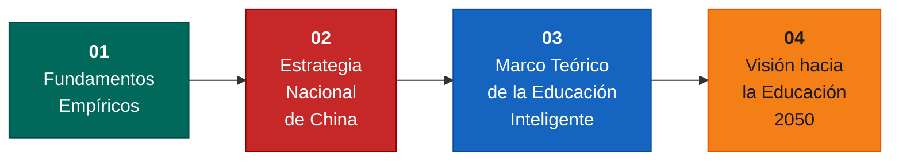
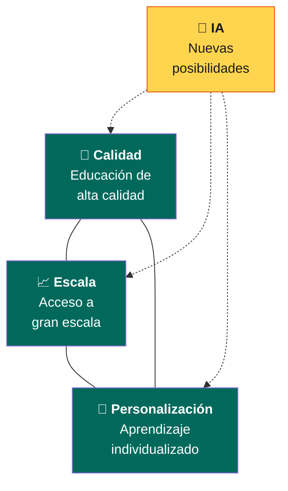
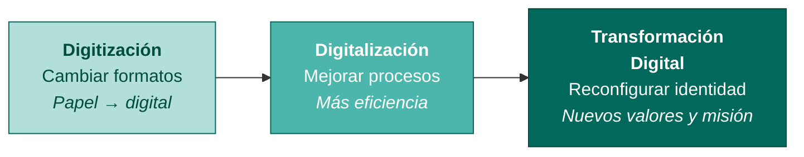
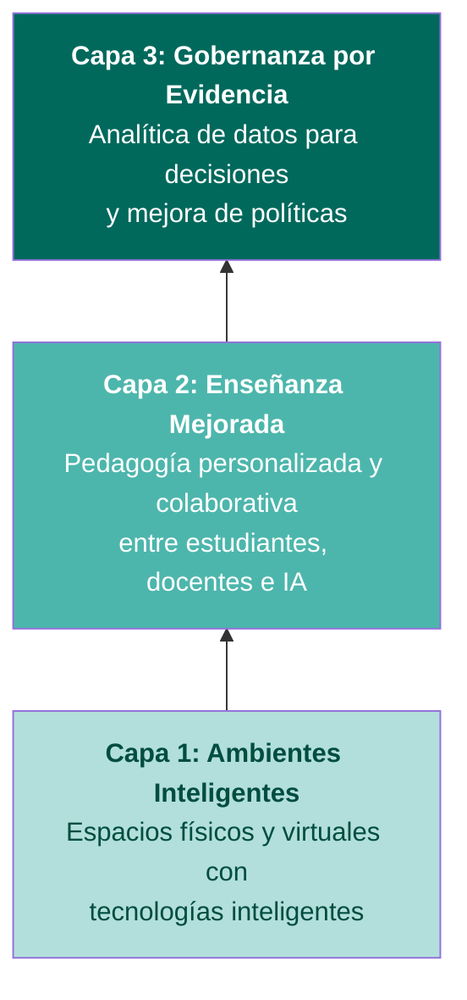

<!-- PORTADA -->

Programa de Invierno INFOTEC · China-América Latina

# Transformación Digital hacia la Educación Inteligente en la Era de la Inteligencia

## Estrategias, Iniciativas y Prácticas en China

Prof. Ronghuai Huang (黄荣怀) 
Instituto de Aprendizaje Inteligente · Universidad Normal de Beijing 
Cátedra UNESCO de Inteligencia Artificial en Educación

教育

---
layout: two-cols
---

# ¿Quién es Ronghuai Huang?

<v-clicks>

- **Co-director** del Instituto de Aprendizaje Inteligente (IEI) de la Universidad Normal de Beijing

- **Titular** de la Cátedra UNESCO de IA en Educación

- **Líneas de investigación**: educación inteligente, ambientes digitales de aprendizaje, inteligencia artificial aplicada a la educación

- Trabaja con universidades, organizaciones internacionales y gobiernos para promover el **uso responsable e inclusivo de la IA en educación**

- Enfoque especial en el **ODS 4** (Objetivo de Desarrollo Sostenible 4): educación inclusiva y equitativa de calidad para todos

</v-clicks>

::right::

---

# Estructura de la Conferencia

<v-click>

> 💡 Las ideas provienen tanto de **investigación académica** como de **experiencias prácticas** en la transformación digital educativa de China.

> 🌍 El trabajo se realiza a través de la **Cátedra UNESCO de IA en Educación**, en colaboración con universidades, gobiernos y organizaciones internacionales.

</v-click>

---

# Misión de la Cátedra UNESCO de IA en Educación

En la era de la inteligencia, la UNESCO ha identificado prioridades clave para guiar el desarrollo responsable de la IA en educación.

<v-click>

<h4>🎓 Desarrollo de Capacidades</h4>

Ayudar a educadores e instituciones a desarrollar los conocimientos y habilidades necesarios para integrar la IA efectivamente en la enseñanza y el aprendizaje.

</v-click>

<v-click>

<h4>📋 Diálogo de Políticas</h4>

Conectar la investigación académica con discusiones de política pública para apoyar el desarrollo de estrategias nacionales de IA en educación que sean confiables.

</v-click>

<v-click>

<h4>🌍 Alineación con ODS 4</h4>

Garantizar que el desarrollo de la IA en educación contribuya a una educación inclusiva, equitativa y de calidad para todos.

</v-click>

---

<!-- TRANSICIÓN SECCIÓN B -->

01

Parte 1

# ¿Por qué la transformación digital es una prioridad global?

### Fundamentos Empíricos

---

DESPERTAR

# El Despertar Sistémico de la Educación

<v-clicks>

- **Antes de la IA generativa**: la educación era una **receptora pasiva** del cambio tecnológico. Aparecían nuevas tecnologías y los sistemas educativos se adaptaban lentamente.

- **La IA generativa es diferente**: está empujando a educadores, instituciones y legisladores a **reexaminar** cómo se crea el conocimiento, cómo ocurre el aprendizaje y cuál debe ser el papel de la educación en el futuro.

- Este momento de reflexión representa un **despertar sistémico**: los sistemas educativos están comenzando a pasar de la recepción pasiva al **liderazgo activo**, dando forma proactiva al futuro del aprendizaje en colaboración con la IA.

</v-clicks>

<v-click>

De receptor pasivo → a reflexión profunda → a liderazgo activo

</v-click>

---
layout: two-cols
---

# La Brecha de Uso

En muchos países, el acceso al hardware ya se logró: dispositivos, internet, plataformas digitales. **Pero el acceso por sí solo no garantiza aprendizaje significativo.**

<v-clicks>

### Tres problemas concretos:

1. **Docentes inseguros** sobre cómo integrar tecnología en su enseñanza

2. **Regiones rurales** con dispositivos pero sin recursos digitales de aprendizaje de calidad

3. **La infraestructura avanza más rápido** que la innovación pedagógica

</v-clicks>

::right::

<v-click>

<h4 style="color:#FFD54F">Conclusión clave</h4>

El verdadero reto hoy no es solo proveer tecnología, sino asegurar su <strong>uso significativo y efectivo</strong> en la educación.

</v-click>

---

# La Trinidad Imposible en Educación

Los sistemas educativos buscan lograr tres metas simultáneamente:

<v-click>

> La educación personalizada de alta calidad solo es posible en clases pequeñas o instituciones de élite. Los sistemas a gran escala dependen de modelos estandarizados. **La IA abre nuevas posibilidades** para equilibrar calidad, escala y personalización.

</v-click>

---

# La Escala del Sistema Educativo Chino

<v-click>

280M

Estudiantes

</v-click>

<v-click>

440,000

Escuelas

</v-click>

<v-click>

18.7M

Docentes

</v-click>

<v-click>

<h4 style="color:#FFD54F">Preescolar</h4>

> 92% de matrícula

<h4 style="color:#FFD54F">Educación Superior</h4>

Tasa bruta > 60%, duplicada desde 2012

</v-click>

CHINA

---

# Equidad e Inclusión en Cifras

<v-clicks>

| Indicador | Dato |
|-----------|------|
| Hijos de migrantes en escuelas públicas o apoyadas por el gobierno | **> 97%** |
| Niños con discapacidad en educación obligatoria | **> 97%** |
| Estudiantes apoyados anualmente por becas nacionales | **~150 millones** |
| Acceso a internet en escuelas | **~100%** |
| Aulas con equipamiento multimedia | **~98%** |

</v-clicks>

<v-click>

La infraestructura digital es un prerrequisito para la innovación educativa. Sin conectividad universal y acceso a recursos, es muy difícil que nuevos modelos de enseñanza lleguen a todos los estudiantes.

</v-click>

---

<!-- TRANSICIÓN SECCIÓN C -->

02

Parte 2

# Del diagnóstico a la acción: la estrategia digital educativa de China

### Estrategia Nacional

---

# Modernización Educativa 2035: El Plan Rector

Plan a largo plazo que guía la reforma educativa de China con la tecnología como habilitador clave.

<v-click>

<h4>📐 Planificación Sistémica</h4>

Reforma educativa vista como sistema integrado: gobernanza, currículo, pedagogía y gestión institucional.

</v-click>

<v-click>

<h4>🔗 Integración Profunda</h4>

No solo introducir herramientas digitales, sino <strong>repensar fundamentalmente</strong> cómo ocurre la enseñanza y el aprendizaje.

</v-click>

<v-click>

<h4>🧠 Reforma Formativa</h4>

Preparar estudiantes no para la economía industrial del pasado, sino para la <strong>economía del conocimiento impulsada por IA</strong>.

</v-click>

---

# Convergencia con el ODS 4

<h4>🇨🇳 Estrategia Nacional China</h4>

Modernización Educativa 2035: educación inclusiva, de calidad y permanente como base del desarrollo nacional.

⟷

<h4>🌍 Agenda Global ODS 4</h4>

Educación inclusiva, equitativa, de calidad y oportunidades de aprendizaje permanente para todos.

<v-click>

<strong>Visión compartida:</strong> la tecnología debe ser herramienta para expandir oportunidad y equidad,  no para crear nuevas formas de exclusión.

</v-click>

---

# La Digitalización como Motor Estratégico

Cuando la educación prospera, la nación prospera.

— Dicho ampliamente citado en China

<v-click>

La digitalización **no es una mejora tecnológica** — es el **motor central** de la transformación sistémica:

</v-click>

<v-clicks>

1. **Abre nuevas vías** de desarrollo, permitiendo superar limitaciones tradicionales
2. **Impulsa calidad, equidad y eficiencia** simultáneamente
3. **Apoya la visión** de convertirse en potencia educativa global

</v-clicks>

---

# Plataforma Nacional de Educación Inteligente

**Plataforma de Servicio Público de Educación Inteligente** — lanzada en 2022, actualizada a versión 2.0 en 2025.

<v-clicks>

- La plataforma de **recursos educativos digitales integrados más grande del mundo**

- Cubre **educación básica, superior y aprendizaje permanente**

- Todos los recursos son de **acceso abierto y gratuito** para todos los estudiantes

- Contribuye al **intercambio global de conocimiento** y al desarrollo de recursos educativos abiertos (REA)

</v-clicks>

<v-click>

47 millones

de recursos de aprendizaje digital

61 mil millones

de visitas acumuladas

</v-click>

---

# Acción Estratégica de Digitalización Educativa

Lanzada en la **Conferencia Mundial de Educación Digital 2025**. No se enfoca en herramientas aisladas, sino en **transformación sistémica**.

<v-clicks>

### Tres principios rectores:

**1. Desarrollo impulsado por la demanda**
Diseñar desde las necesidades reales de estudiantes y educadores.

**2. Implementación centrada en la práctica**
Impacto educativo real, no solo despliegue de infraestructura.

**3. Desarrollo orientado al servicio**
Los sistemas digitales deben servir a docentes, estudiantes y administradores.

</v-clicks>

---

# Estrategia 3C + 3I

### Las 3C

<v-clicks>

<h4 style="margin-bottom:4px">🔌 Conexión</h4>

Conectividad universal y de calidad como base de la equidad digital.

<h4 style="margin-bottom:4px">📚 Contenido</h4>

Recursos de aprendizaje digital de calidad, culturalmente relevantes.

<h4 style="margin-bottom:4px">🤝 Cooperación</h4>

Colaboración nacional e internacional para expandir recursos e innovación.

</v-clicks>

### Las 3I

<v-clicks>

<h4 style="margin-bottom:4px">🔄 Integrado</h4>

Fusión fluida entre aprendizaje en línea y presencial.

<h4 style="margin-bottom:4px">🧠 Inteligente</h4>

IA para aprendizaje adaptativo, evaluación inteligente y gobernanza educativa.

<h4 style="margin-bottom:4px">🌐 Internacional</h4>

Posicionamiento dentro de un marco de colaboración global.

</v-clicks>

---

# Los Cuatro Futuros

<v-click>

<h4 style="color:#FFD54F">👨‍🏫 Docentes del Futuro</h4>

Ya no transmisores de conocimiento, sino <strong>diseñadores de experiencias</strong> y orquestadores de la colaboración humano-IA.

</v-click>

<v-click>

<h4 style="color:#FFD54F">🏫 Aulas del Futuro</h4>

Ambientes dinámicos y flexibles que <strong>fusionan espacios físicos y virtuales</strong> para un aprendizaje interactivo y personalizado.

</v-click>

<v-click>

<h4 style="color:#FFD54F">🏛️ Escuelas del Futuro</h4>

<strong>Ecosistemas abiertos de aprendizaje</strong> integrados en la comunidad, no espacios institucionales aislados.

</v-click>

<v-click>

<h4 style="color:#FFD54F">📖 Centros de Aprendizaje</h4>

Educación <strong>permanente y a demanda</strong>, sirviendo a personas en todas las etapas de la vida.

</v-click>

---

<!-- TRANSICIÓN SECCIÓN D -->

03

Parte 3

# ¿Qué paradigma educativo está emergiendo en la era de la inteligencia?

### Marco Teórico de la Educación Inteligente

---

# Tres Etapas de la Evolución Digital

<v-clicks>

- **Digitización**: convierte información analógica a formato digital. Los procesos no cambian.

- **Digitalización**: tecnologías mejoran y automatizan procesos. Mayor eficiencia, pero los valores y estructuras del sistema permanecen iguales.

- **Transformación digital**: cambio profundo — no solo procesos, sino **cultura organizacional, valores y formas de pensar**. Las instituciones replantean cómo operan, a quién sirven y cuál es su misión.

</v-clicks>

---

# Marco de Transformación Digital en Educación

### Tres fases

<v-clicks>

**1. Preparación digital**
Infraestructura TIC, dispositivos, acceso a recursos educativos digitales de calidad.

**2. Prácticas digitales**
Sistemas de gestión educativa, aplicaciones pedagógicas, ambientes de aprendizaje en línea.

**3. Desempeño digital**
Analítica de datos, computación en la nube, ambientes inteligentes de aprendizaje.

</v-clicks>

<v-click>

### Seis elementos esenciales

1. Infraestructura y equipamiento digital
2. Libros de texto y recursos digitales
3. Aplicaciones e innovaciones educativas
4. Recursos humanos con alfabetización digital
5. Apoyo de la industria TIC
6. Marcos regulatorios y estándares técnicos

</v-click>

---

# Los "Cuatro Todos" de la Transformación

La transformación digital es **sistémica, no cosmética**. No agrega tecnologías a estructuras existentes — **reconfigura todo el ecosistema educativo**.

<v-click>

<h4>📋 Todos los Elementos</h4>

Metas de aprendizaje, contenidos y métodos de enseñanza <strong>rediseñados</strong> para la era digital.

</v-click>

<v-click>

<h4>🔄 Todos los Procesos</h4>

Matrícula, enseñanza, aprendizaje y gestión <strong>completamente apoyados</strong> por tecnología digital.

</v-click>

<v-click>

<h4>🎯 Todos los Servicios</h4>

Servicios al estudiante y operaciones administrativas transformados para mejorar eficiencia, accesibilidad y calidad.

</v-click>

<v-click>

<h4>🌐 Todos los Campos</h4>

Desde educación básica hasta superior, formación profesional y aprendizaje permanente.

</v-click>

---

# ¿Qué es la Educación Inteligente?

No es educación tradicional mejorada con herramientas digitales. 
Es una <strong style="color:#FFD54F">forma claramente definida de educación</strong> para la era de la inteligencia.

<v-click>

<h4 style="color:#FFD54F">🌟 Alta Experiencia</h4>

Estudiantes profundamente comprometidos e intrínsecamente motivados, con apoyo continuo a lo largo de todo el proceso de aprendizaje.

</v-click>

<v-click>

<h4 style="color:#FFD54F">🔄 Adaptabilidad</h4>

Currículo y recursos que se adaptan dinámicamente a las necesidades, contexto y progreso de cada estudiante.

</v-click>

<v-click>

<h4 style="color:#FFD54F">⚡ Eficiencia Docente</h4>

Tecnologías inteligentes liberan al docente de tareas repetitivas para enfocarse en mentoría, guía y creatividad.

</v-click>

---

# Los Tres Reinos de la Educación Inteligente

Tres capas arquitectónicas — cada una construida sobre la anterior.

<v-click>

> Los ambientes inteligentes posibilitan nuevas pedagogías, y una gobernanza efectiva sostiene la transformación educativa.

</v-click>

---

# Cuatro Dimensiones de una Estrategia Nacional

<v-clicks>

**1. Enseñanza y aprendizaje transformadores**
Pedagogía centrada en el estudiante, rediseño de evaluación, apoyo al desarrollo socioemocional.

**2. Ambiente digital de aprendizaje propicio**
Dispositivos de aprendizaje, conectividad confiable, uso responsable y ético de tecnologías emergentes.

**3. Gobernanza y políticas con visión de futuro**
Visión nacional clara, capacidad de infraestructura, inversión en capital humano.

**4. Consideraciones transversales**
Inclusión y equidad, cultura de mejora continua, alianzas intersectoriales fuertes.

</v-clicks>

---

# Cinco Rasgos Performativos

Metas observables que indican si se ha logrado la educación inteligente.

<v-clicks>

1. **Centrado en el estudiante** — agencia, voz, autonomía y trayectorias personalizadas

2. **Evaluación integral** — más allá de exámenes estandarizados: creatividad, colaboración, resolución de problemas

3. **Ambientes de aprendizaje ubicuos** — aprender en cualquier momento y lugar, en espacios físicos, digitales e híbridos

4. **Cultura de mejora continua** — datos como espejo para la reflexión y la mejora constante de la enseñanza

5. **Equidad como principio central** — la tecnología digital debe cerrar brechas educativas, no ampliarlas

</v-clicks>

---

# Cinco Rasgos Constructivos

Caminos habilitadores para construir sistemas de educación inteligente.

<v-clicks>

1. **Comunidades sociales de aprendizaje** — redes colaborativas entre estudiantes, docentes e instituciones como motor de construcción de conocimiento

2. **Priorizar el desarrollo docente** — la inversión de mayor retorno para mejorar los sistemas educativos en la era digital

3. **Adopción ética de tecnología** — supervisión sólida, transparencia y rendición de cuentas para garantizar innovación responsable

4. **Planificación sostenible** — estrategias a largo plazo que trasciendan ciclos políticos y asignaciones temporales de fondos

5. **Colaboración multisectorial** — gobierno, industria, academia y sociedad civil trabajando juntos para crear ecosistemas alineados

</v-clicks>

---

# Las Cuatro Nuevas Visiones de la Educación Futura

<v-click>

<h4 style="color:#FFD54F">🔭 Nuevos Horizontes del Conocimiento</h4>

El conocimiento ya no se transmite — se <strong>co-crea</strong> entre humanos, sistemas de IA y comunidades de aprendizaje.

</v-click>

<v-click>

<h4 style="color:#FFD54F">🗺️ Nuevos Paisajes de Aprendizaje</h4>

De recepción pasiva a <strong>exploración autodirigida</strong>: curiosidad, motivación y agencia como motores.

</v-click>

<v-click>

<h4 style="color:#FFD54F">📐 Nuevos Patrones Curriculares</h4>

En lugar de rutas estandarizadas, <strong>trayectorias personalizadas</strong> que se adaptan a necesidades, intereses y metas.

</v-click>

<v-click>

<h4 style="color:#FFD54F">🤝 Nuevos Paradigmas de Enseñanza</h4>

Docentes e IA <strong>no compiten</strong> — colaboran de manera complementaria, cada uno aportando lo que el otro no puede reemplazar.

</v-click>

---

# Marco HAR: El Ecosistema Humano-IA en el Aula

Publicado en el <em>Journal of Applied Learning and Teaching</em>.

<v-click>

<h4 style="margin-bottom:4px">👨‍🏫 Docentes Humanos</h4>

<strong>Insustituibles</strong> en empatía, guía ética, creatividad y apoyo socioemocional.

</v-click>

<v-click>

<h4 style="margin-bottom:4px">🖥️ Avatares de IA</h4>

Agentes instruccionales virtuales: apoyo escalable y siempre disponible — explicaciones, retroalimentación, tutoría.

</v-click>

<v-click>

<h4 style="margin-bottom:4px">📊 Gemelos Digitales</h4>

Modelos computacionales de estudiantes y aprendizaje: simulación, predicción, trayectorias personalizadas.

</v-click>

<v-click>

<h4 style="margin-bottom:4px">🤖 Robots Educativos</h4>

IA en ambientes físicos: experiencias prácticas, colaborativas y tangibles, especialmente en CTIM.

</v-click>

<v-click>

> Juntos forman un **ecosistema colaborativo** donde la tecnología amplifica la enseñanza y el educador humano sigue siendo central.

</v-click>

---

# Pedagogía Digital: Cuatro Pilares

No es enseñanza tradicional con herramientas digitales — es una **nueva ciencia pedagógica** para la era digital.

<v-click>

<h4 style="margin-bottom:4px">1. Competencia Digital Profunda</h4>

Navegar herramientas y entornos de información para experiencias de aprendizaje significativas y profundas.

</v-click>

<v-click>

<h4 style="margin-bottom:4px">2. Práctica Basada en Evidencia</h4>

Estrategias guiadas por investigación y apoyadas en materiales digitales bien diseñados.

</v-click>

<v-click>

<h4 style="margin-bottom:4px">3. Ambientes con Tecnología Apropiada</h4>

Tecnología integrada de forma reflexiva para apoyar — no distraer — la enseñanza y el aprendizaje.

</v-click>

<v-click>

<h4 style="margin-bottom:4px">4. Sinergia Humano-IA</h4>

Educadores y sistemas de IA confiables colaborando de manera complementaria.

</v-click>

---

<!-- TRANSICIÓN SECCIÓN E -->

04

Parte 4

# ¿Qué competencias necesitan los ciudadanos de la sociedad inteligente?

### Visión hacia 2050

---

# Cinco Competencias del Ciudadano Digital

Publicadas en <em>Horizontes de la AIU</em> (<em>IAU Horizons</em>).

<v-clicks>

1. **Aprendizaje activo a lo largo de la vida** — En un mundo cambiante, las personas deben actualizar continuamente sus conocimientos y habilidades.

2. **Creatividad en el uso de la IA** — No solo consumir contenido generado por IA, sino **colaborar creativamente** con sistemas inteligentes.

3. **Adaptabilidad en entornos laborales flexibles** — Las carreras del futuro involucrarán roles dinámicos y en evolución que requieren flexibilidad y desarrollo continuo.

4. **Resiliencia ante la incertidumbre** — Navegar cambios tecnológicos y sociales acelerados manteniendo la capacidad de aprender y adaptarse.

5. **Capacidad de prosperar en entornos de IA** — Coexistencia productiva donde la inteligencia humana y la inteligencia artificial trabajan juntas.

</v-clicks>

---

# IA Confiable en Educación

La adopción de IA en educación **no puede depender de suposiciones ni de optimismo**. Requiere:

<v-clicks>

- **Estructuras sólidas de gobernanza** para la IA educativa

- **Mecanismos sistemáticos** de evaluación de impactos reales a lo largo del tiempo

- **Experimentos Sociales Inteligentes (ESI)**: estudios a largo plazo que examinan cómo la IA influye en calidad de enseñanza, resultados de aprendizaje y gestión institucional

- Alineados con la **Década Internacional de Ciencias para el Desarrollo Sostenible (2024-2033)**

</v-clicks>

<v-click>

La meta no es solo construir IA más segura, sino desarrollar <strong>IA demostrablemente benéfica</strong>, donde la evidencia de impacto positivo sea la base para su despliegue continuo.

</v-click>

---

FUTURO

# Colaboración China-América Latina

<v-click>

<h4 style="color:#FFD54F;margin-bottom:4px">1. Aprender sobre la IA y su uso responsable</h4>

Entender cómo funciona la IA y cómo aplicarla ética y responsablemente en educación y sociedad.

</v-click>

<v-click>

<h4 style="color:#FFD54F;margin-bottom:4px">2. Explorar cómo la IA mejora el aprendizaje</h4>

Aprendizaje personalizado, mejor apoyo al desarrollo académico y mayor eficiencia en la educación superior.

</v-click>

<v-click>

<h4 style="color:#FFD54F;margin-bottom:4px">3. Intercambio académico intercultural</h4>

Investigación conjunta, plataformas digitales de aprendizaje y movilidad estudiantil entre China y América Latina.

</v-click>

<v-click>

<h4 style="color:#FFD54F;margin-bottom:4px">4. Desarrollar competencias digitales para el futuro</h4>

Prepararse para carreras en un mundo cada vez más inteligente y globalmente conectado.

</v-click>

---

# Reflexión Final

En la era de la inteligencia, la tecnología se hará cargo cada vez más de las tareas rutinarias. Pero la verdadera misión de la educación siempre será profundamente humana.

La tecnología se encarga de lo rutinario. Los seres humanos se dedican a pensar, sentir y crear significado.

El futuro de la educación no está en reemplazar docentes con máquinas, sino en construir una nueva alianza entre la inteligencia humana y la inteligencia artificial.

— Prof. Ronghuai Huang

---

# Preguntas del Público

<h4 style="margin-bottom:4px;font-size:0.9rem">¿Cómo usar IA para aprender idiomas?</h4>

Recursos de la plataforma nacional china, aplicaciones especializadas, modelos de lenguaje como DeepSeek para practicar vocabulario y lectura.

<h4 style="margin-bottom:4px;font-size:0.9rem">¿Cómo habilita la IA la adaptabilidad de contenidos?</h4>

En clases de 40-45 estudiantes, la IA permite diferenciar la enseñanza — ayudando individualmente a escribir ensayos, ajustando nivel y retroalimentación.

<h4 style="margin-bottom:4px;font-size:0.9rem">¿Están las plataformas chinas disponibles para otros países?</h4>

En expansión: versión en inglés, contribuciones a la pasarela UNESCO de aprendizaje digital público, plataformas abiertas tipo MOOC.

<h4 style="margin-bottom:4px;font-size:0.9rem">¿Cómo mantenerse actualizado como docente?</h4>

Gobiernos deben proveer políticas e infraestructura; usar REA; <strong>los docentes deben aprender primero</strong> para luego guiar a estudiantes.

---

谢谢

# Gracias

Prof. Ronghuai Huang (黄荣怀) 
Instituto de Aprendizaje Inteligente · Universidad Normal de Beijing 
Cátedra UNESCO de Inteligencia Artificial en Educación 
 
Plataforma Nacional de Educación Inteligente de China 
smartedu.cn

