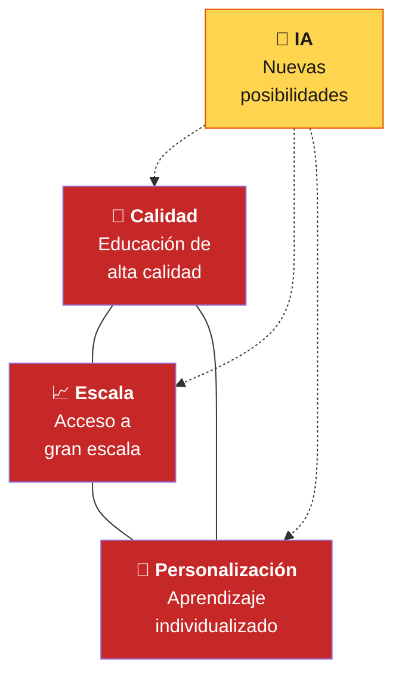
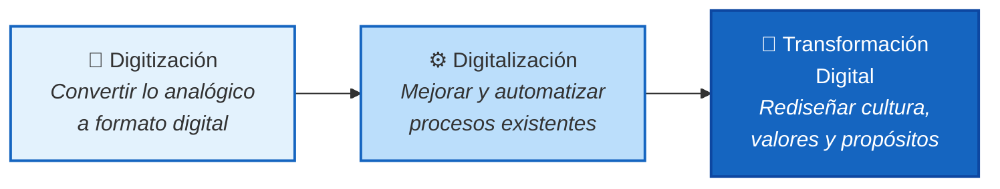

<!-- SLIDE 1: PORTADA -->

Programa de Invierno · INFOTEC · China-América Latina

# ¿Cómo se Viste el Docente Digital?

## Lecciones desde la experiencia china para la práctica docente en México

Basado en la conferencia del Prof. Ronghuai Huang (黄荣怀) 
Instituto de Aprendizaje Inteligente · Universidad Normal de Beijing 
Cátedra UNESCO de Inteligencia Artificial en Educación

教育

---

<!-- SLIDE 2: ¿QUIÉN ES HUANG? -->

El Ponente

# ¿Quién es Ronghuai Huang?

<v-clicks>

- **Co-director** del Instituto de Aprendizaje Inteligente de la Universidad Normal de Beijing

- **Titular** de la **Cátedra UNESCO de IA en Educación** — investigación, cooperación y desarrollo de capacidades

- Investiga **educación inteligente**, ambientes digitales de aprendizaje e IA aplicada a la educación

- Trabaja con universidades, gobiernos y organismos internacionales para el uso **responsable e inclusivo** de la IA

- Enfoque en el **ODS 4**: educación inclusiva, equitativa y de calidad para todos

</v-clicks>

---

<!-- SLIDE 3: ¿POR QUÉ NOS IMPORTA EN MÉXICO? -->

Relevancia

# ¿Por qué importa esto en México?

### Lo que dice Huang

<v-clicks>

- Tener acceso a tecnología **no garantiza** aprendizaje significativo — la **brecha de uso** es el verdadero reto

- Los docentes **no saben cómo integrar** tecnología de manera pedagógica

- La **trinidad imposible**: calidad + escala + personalización — históricamente no se logran las tres

- La IA generativa **no es una ola más**, obliga a repensar los cimientos del sistema educativo

</v-clicks>

---

<!-- SLIDE 4: EL DIAGNÓSTICO — DIAGRAMA -->

El Problema

# La Trinidad Imposible en Educación

<v-click>

> La educación personalizada de alta calidad solo es posible en clases pequeñas o instituciones de élite. Los sistemas a gran escala dependen de modelos estandarizados. **La IA abre nuevas posibilidades** para equilibrar las tres metas.

</v-click>

---

<!-- SLIDE 5: TRANSICIÓN — PARTE 1 -->

路

# La Ruta China: Del Diagnóstico a la Acción

¿Cómo un país con 280 millones de estudiantes abordó estos problemas?

---

<!-- SLIDE 6: LA ESCALA DEL DESAFÍO — DATA SLIDE -->

La Escala

<h1 style="color:#fff">El Sistema Educativo Más Grande del Mundo</h1>

<v-click>

280M

Estudiantes

</v-click>

<v-click>

440,000

Escuelas

</v-click>

<v-click>

18.7M

Docentes

</v-click>

<v-click>

<strong style="color:#FFD54F">> 92%</strong> matrícula preescolar

·

<strong style="color:#FFD54F">> 60%</strong> tasa bruta educación superior

</v-click>

CHINA

---

<!-- SLIDE 7: EQUIDAD A ESCALA -->

Equidad

# Equidad a Escala: Los Datos de China

97%

Hijos de migrantes en escuelas públicas

97%

Niños con discapacidad en educación obligatoria

150M

Estudiantes con beca anualmente

~100%

Escuelas con acceso a internet

98%

Aulas con equipamiento multimedia

La infraestructura digital es prerrequisito para la innovación. <strong>Estos números demuestran que la inclusión a escala no es utopía — es política pública con ejecución sostenida.</strong>

---

<!-- SLIDE 8: TRES ETAPAS -->

Paso 1

# Tres Etapas de Evolución Digital

<v-clicks>

- **Digitización** cambia formatos (escanear documentos, crear archivos digitales)
- **Digitalización** mejora procesos (sistemas de gestión, plataformas en línea)
- **Transformación Digital** redefine la identidad y el propósito del sistema educativo

</v-clicks>

💡 <strong>Reflexiona:</strong> ¿En qué etapa consideras que se encuentra tu institución?

---

<!-- SLIDE 9: PLATAFORMA NACIONAL + 3C/3I -->

Paso 2

# La Estrategia 3C + 3I en Acción

### Las 3C

<v-clicks>

- **Conexión** — Conectividad universal. Sin acceso confiable, la educación digital no llega a todos
- **Contenido** — Recursos digitales de calidad, culturalmente relevantes
- **Cooperación** — Colaboración institucional nacional e internacional

</v-clicks>

### Las 3I

<v-clicks>

- **Integración** — Fusión presencial + en línea
- **Inteligencia** — IA adaptativa y gobernanza inteligente
- **Internacionalización** — Marco de colaboración global

</v-clicks>

47M recursos · 61B visitas

Plataforma Nacional — la más grande del mundo · acceso abierto y gratuito

---

<!-- SLIDE 10: EDUCACIÓN INTELIGENTE + IMAGE -->

Paso 3

<h1 style="color:#fff">La Meta: Educación Inteligente</h1>

Según Huang, no es educación tradicional con herramientas digitales. Es una forma de educación <strong>claramente definida</strong> para la era de la inteligencia.

<h4 style="color:var(--c-yellow);margin-bottom:2px;font-size:0.85rem">Alta Experiencia de Aprendizaje</h4>

Estudiantes profundamente involucrados y motivados. Apoyo continuo e interacción significativa.

<h4 style="color:var(--c-yellow);margin-bottom:2px;font-size:0.85rem">Adaptabilidad del Contenido</h4>

Currículo y recursos que se adaptan dinámicamente a las necesidades y progreso de cada estudiante.

<h4 style="color:var(--c-yellow);margin-bottom:2px;font-size:0.85rem">Eficiencia Docente</h4>

La tecnología libera al docente de tareas repetitivas para enfocarse en mentoría, guía y creatividad.

---

<!-- SLIDE 11: 4 FUTUROS -->

Visión 2050

<h1 style="color:#fff">Los Cuatro Futuros de la Educación</h1>

Del Libro Blanco de Educación Inteligente de China (2025)

<h4 style="color:var(--c-yellow);margin-bottom:4px">👨‍🏫 Docentes del Futuro</h4>

Ya no transmisores de conocimiento, sino <strong>diseñadores de experiencias de aprendizaje</strong> y orquestadores de la colaboración humano-IA.

<h4 style="color:var(--c-yellow);margin-bottom:4px">🏫 Aulas del Futuro</h4>

Ambientes dinámicos y flexibles que <strong>fusionan espacios físicos y virtuales</strong> para aprendizaje interactivo y personalizado.

<h4 style="color:var(--c-yellow);margin-bottom:4px">🏛️ Escuelas del Futuro</h4>

<strong>Ecosistemas abiertos de aprendizaje</strong> integrados en la comunidad, no espacios institucionales aislados.

<h4 style="color:var(--c-yellow);margin-bottom:4px">📖 Centros de Aprendizaje</h4>

Educación <strong>permanente y a demanda</strong>, sirviendo a personas en todas las etapas de la vida.

---

<!-- SLIDE 12: CITA MID-DECK + HAR -->

La tecnología se encarga de lo rutinario. Los seres humanos se dedican a pensar, sentir y crear significado.

— Prof. Ronghuai Huang

<strong>Marco HAR:</strong> Humanos + Avatares de IA + Gemelos Digitales + Robots forman un ecosistema colaborativo donde <strong>el educador humano sigue siendo central</strong> — insustituible en empatía, ética y creatividad.

---

<!-- SLIDE 13: 5 COMPETENCIAS CIUDADANO DIGITAL -->

Competencias

# 5 Competencias del Ciudadano Digital

Publicadas por Huang en <em>Horizontes de la AIU (IAU Horizons)</em> — lo que tus estudiantes necesitan para prosperar

1

<strong>Aprendizaje activo a lo largo de la vida</strong> Actualizar continuamente conocimientos y habilidades en un mundo cambiante

2

<strong>Creatividad en el uso de la IA</strong> No solo consumir contenido generado — colaborar creativamente con sistemas inteligentes

3

<strong>Adaptabilidad en entornos laborales flexibles</strong> Roles dinámicos que exigen flexibilidad y desarrollo continuo de nuevas capacidades

4

<strong>Resiliencia ante la incertidumbre</strong> Navegar cambios tecnológicos y sociales acelerados manteniendo la capacidad de aprender

5

<strong>Prosperar en entornos de IA</strong> Coexistencia productiva entre inteligencia humana e inteligencia artificial

💡 De estas cinco, <strong>¿cuál es la que menos desarrollas en tus estudiantes actualmente?</strong>

---

<!-- SLIDE 14: TRANSICIÓN — TU PRÁCTICA -->

✦

# ¿Y esto qué significa para tu práctica?

Del modelo chino al Traje del Docente — conexión con tu formación

---

<!-- SLIDE 15: MAPEO HUANG → TRAJE + IMAGE -->

Conexión con tu formación

# De Huang al Traje del Docente

<strong style="color:var(--c-socio)">Socioemocional</strong> 
Docentes humanos son <em>irremplazables</em> en empatía, guía ética y creatividad. El marco HAR coloca al humano como centro.

<strong style="color:var(--c-tech)">Tecnología Pedagógica</strong> 
Superar la brecha de uso: integración profunda de tecnología Y pedagogía. Los 4 pilares de la pedagogía digital son clave.

<strong style="color:var(--c-innov)">Innovación</strong> 
De receptor pasivo a <em>liderazgo activo</em>. Los "4 todos" transforman cada elemento, proceso y campo del sistema.

<strong style="color:var(--c-design)">Diseño Instruccional</strong> 
El docente del futuro: <em>diseñador de experiencias</em> y orquestador humano-IA. Contenido que se adapta dinámicamente.

---

<!-- SLIDE 16: PREGUNTAS 1+2 MERGED — DESAFÍOS Y PRIORIDADES -->

Preguntas 1 y 2

<h1 style="color:#fff">¿Qué es más desafiante y qué necesita más desarrollo?</h1>

<h4 style="color:var(--c-yellow);margin-bottom:2px;font-size:0.85rem">🔴 Tecnología Pedagógica — Prioridad Alta</h4>

La <strong>brecha de uso</strong> es el reto central: la infraestructura avanzó más rápido que la innovación pedagógica. Los 4 pilares de la pedagogía digital son el camino de cierre.

<h4 style="color:var(--c-yellow);margin-bottom:2px;font-size:0.85rem">🔴 Diseño Instruccional — Prioridad Alta</h4>

Los <strong>"4 todos"</strong> exigen rediseñar metas, contenidos y procesos. El docente debe diseñar <strong>trayectorias de aprendizaje personalizadas</strong>.

<h4 style="color:var(--c-yellow);margin-bottom:2px;font-size:0.85rem">🟡 Innovación — En Transición</h4>

El <strong>despertar sistémico</strong> exige pasar de receptor pasivo a liderazgo activo. Transformación digital = cambio de identidad, no de herramientas.

<h4 style="color:var(--c-yellow);margin-bottom:2px;font-size:0.85rem">⚡ Socioemocional — Insustituible, Bajo Presión</h4>

Lo que la IA <strong>no puede reemplazar</strong>. Pero está bajo presión: creatividad con IA, resiliencia ante incertidumbre y coexistencia humano-IA son desafíos nuevos.

---

<!-- SLIDE 17: PREGUNTA 3 — CÓMO APOYAN LAS INSTITUCIONES -->

Pregunta 3

<h1 style="color:#fff">¿Cómo pueden las instituciones apoyar este nuevo perfil?</h1>

Huang propone 5 caminos constructivos — los cimientos institucionales de la educación inteligente:

<h4 style="color:var(--c-yellow);margin-bottom:2px;font-size:0.82rem">1. Priorizar el Desarrollo Docente</h4>

<strong>La inversión de mayor retorno</strong> para mejorar los sistemas educativos en la era digital.

<h4 style="color:var(--c-yellow);margin-bottom:2px;font-size:0.82rem">2. Comunidades de Aprendizaje</h4>

<strong>Redes colaborativas</strong> como motor de construcción de conocimiento.

<h4 style="color:var(--c-yellow);margin-bottom:2px;font-size:0.82rem">3. Adopción Ética de Tecnología</h4>

Supervisión ética, transparencia y rendición de cuentas.

<h4 style="color:var(--c-yellow);margin-bottom:2px;font-size:0.82rem">4. Planificación Sostenible</h4>

<strong>Estrategias a largo plazo</strong> que trasciendan ciclos políticos.

<h4 style="color:var(--c-yellow);margin-bottom:2px;font-size:0.82rem">5. Colaboración Multisectorial</h4>

Gobierno, industria, academia y sociedad civil: <strong>ecosistemas alineados</strong>.

<h4 style="color:var(--c-yellow);margin-bottom:2px;font-size:0.82rem">+ IA Demostrablemente Benéfica</h4>

La meta no es IA segura sino IA donde la <strong>evidencia de impacto positivo</strong> guíe su despliegue.

---

<!-- SLIDE 18: SÍNTESIS — 5 IDEAS -->

Síntesis

# 5 Ideas de Huang para tu Práctica

<v-clicks>

1

<strong>La tecnología sin pedagogía no transforma.</strong> No basta tener herramientas — necesitas integración profunda de tecnología Y pedagogía para cerrar la brecha de uso.

2

<strong>Tu rol cambia, no desaparece.</strong> De transmisor a diseñador de experiencias. Lo que te hace insustituible: empatía, guía ética, creatividad.

3

<strong>La IA es tu aliada, no tu reemplazo.</strong> El marco HAR: humanos y sistemas inteligentes colaboran, cada uno aporta lo que el otro no puede.

4

<strong>Transforma tu práctica, no solo tus formatos.</strong> La diferencia entre digitalización y transformación digital es un cambio de identidad y propósito.

5

<strong>No estás solo/a.</strong> Comunidades de aprendizaje, colaboración institucional y planificación a largo plazo son los cimientos.

</v-clicks>

---

<!-- SLIDE 19: CIERRE — CITA FINAL -->

En la era de la inteligencia, la tecnología se encargará cada vez más de las tareas rutinarias. Pero la verdadera misión de la educación siempre será profundamente humana. El futuro de la educación no está en reemplazar docentes con máquinas, sino en construir una nueva alianza entre la inteligencia humana y la inteligencia artificial.

— Prof. Ronghuai Huang (黄荣怀)

Programa de Invierno · INFOTEC · China-América Latina · 2.ª Edición

未来

