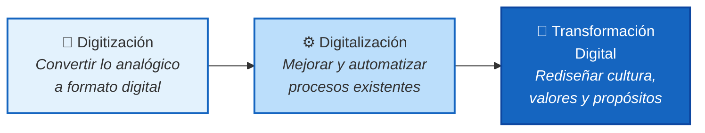

<!-- SLIDE 1: PORTADA -->

Programa de Invierno · INFOTEC · China-América Latina

# ¿Cómo se Viste el Docente Digital?

## Lecciones desde la experiencia china para la práctica docente en México

Basado en la conferencia del Prof. Ronghuai Huang (黄荣怀) 
Instituto de Aprendizaje Inteligente · Universidad Normal de Beijing 
Cátedra UNESCO de Inteligencia Artificial en Educación

教育

---

<!-- SLIDE 2: ¿QUIÉN ES HUANG? -->

El Ponente

# ¿Quién es Ronghuai Huang?

<v-clicks>

- **Co-director** del Instituto de Aprendizaje Inteligente de la Universidad Normal de Beijing — una de las principales instituciones educativas de China

- **Titular** de la **Cátedra UNESCO de Inteligencia Artificial en Educación** — plataforma de investigación, cooperación y desarrollo de capacidades

- Investiga **educación inteligente**, ambientes digitales de aprendizaje e inteligencia artificial aplicada a la educación

- Trabaja con universidades, organizaciones internacionales y gobiernos para promover el uso **responsable e inclusivo** de la IA en educación

- Enfoque en el **ODS 4** (Objetivo de Desarrollo Sostenible 4): educación inclusiva, equitativa y de calidad para todos

</v-clicks>

---

<!-- SLIDE 3: ¿POR QUÉ NOS IMPORTA EN MÉXICO? -->

Relevancia

# ¿Por qué importa esto en México?

### Lo que dice Huang

<v-clicks>

- Tener acceso a tecnología **no garantiza** un aprendizaje significativo — la **brecha de uso** es el verdadero reto

- Los docentes **no saben cómo integrar** la tecnología de manera pedagógica

- La **trinidad imposible**: calidad + escala + personalización — históricamente no se logran las tres al mismo tiempo

- La IA generativa **no es una ola más** de tecnología, obliga a repensar los cimientos del sistema educativo

</v-clicks>

### ¿Lo reconoces en tu contexto?

<v-clicks>

- En México hay tabletas, plataformas y conectividad... pero **¿se usan bien?**

- Muchos docentes enfrentan la misma incertidumbre: **¿cómo paso de "dar clase" a "diseñar experiencias de aprendizaje"?**

- Las escuelas rurales tienen dispositivos pero carecen de **recursos digitales de calidad**

- La IA generativa ya llegó a nuestros estudiantes — **¿estamos preparados como docentes?**

</v-clicks>

---

<!-- SLIDE 4: EL PROBLEMA CENTRAL -->

El Problema

# El diagnóstico de Huang

<h4 style="color:var(--c-red)">Brecha de Uso</h4>

El acceso a tecnología ya existe en muchos lugares. Pero el acceso solo <strong>no produce</strong> aprendizaje significativo. Faltan formación docente, recursos de calidad e innovación pedagógica.

<h4 style="color:var(--c-red)">Trinidad Imposible</h4>

<strong>Calidad + Escala + Personalización</strong>: tradicionalmente solo se logran dos de tres. La educación personalizada de calidad ha sido exclusiva de grupos pequeños o instituciones de élite.

<h4 style="color:var(--c-red)">Despertar Sistémico</h4>

La IA generativa obliga al sistema educativo a pasar de ser <strong>receptor pasivo</strong> de cambio tecnológico a <strong>líder activo</strong> que moldea el futuro del aprendizaje.

💡 <strong>Reflexiona:</strong> ¿En cuál de estos tres problemas sientes que tu práctica docente enfrenta el mayor reto?

---

<!-- SLIDE 5: TRANSICIÓN — LA RUTA CHINA -->

路

# La Ruta China en 3 Pasos

De la infraestructura digital a la transformación profunda del sistema educativo

---

<!-- SLIDE 6: PASO 1 — TRES ETAPAS -->

Paso 1

# Tres Etapas de Evolución Digital

<v-clicks>

- **Digitización** cambia formatos (escanear documentos, crear archivos digitales)
- **Digitalización** mejora procesos (sistemas de gestión, plataformas en línea)
- **Transformación Digital** redefine la identidad y el propósito del sistema educativo

</v-clicks>

💡 <strong>Reflexiona:</strong> ¿En qué etapa consideras que se encuentra tu institución?

---

<!-- SLIDE 7: PASO 2 — ESTRATEGIA 3C + 3I -->

Paso 2

# La Estrategia 3C + 3I

Marco estratégico que guía la Plataforma Nacional de Educación Inteligente de China — la base de datos de recursos educativos más grande del mundo

### Las 3C

<v-clicks>

- **Conexión** — Conectividad universal y de alta calidad. Sin acceso confiable, la educación digital no llega a todos
- **Contenido** — Recursos digitales de calidad, culturalmente relevantes y pedagógicamente diseñados
- **Cooperación** — Colaboración entre instituciones a nivel nacional e internacional para compartir recursos e innovar

</v-clicks>

### Las 3I

<v-clicks>

- **Integración** — Fusión fluida entre aprendizaje presencial y en línea
- **Inteligencia** — Uso de IA para aprendizaje adaptativo, evaluación inteligente y gobernanza educativa
- **Internacionalización** — Las iniciativas de educación digital se insertan en marcos de colaboración global

</v-clicks>

💡 <strong>Reflexiona:</strong> ¿Qué C o qué I es la más débil en tu contexto institucional?

---

<!-- SLIDE 8: PASO 3 — EDUCACIÓN INTELIGENTE -->

Paso 3

<h1 style="color:#fff">La Meta: Educación Inteligente</h1>

Según Huang, la educación inteligente <strong>no es</strong> simplemente educación tradicional con herramientas digitales. Es una forma de educación claramente definida para la era de la inteligencia.

<h4 style="color:var(--c-yellow)">Alta Experiencia de Aprendizaje</h4>

Los estudiantes están profundamente involucrados y motivados intrínsecamente. El ambiente provee apoyo continuo e interacción significativa.

<h4 style="color:var(--c-yellow)">Adaptabilidad del Contenido</h4>

El currículo y los recursos se adaptan dinámicamente a las necesidades, el contexto y el progreso de cada estudiante.

<h4 style="color:var(--c-yellow)">Eficiencia Docente</h4>

La tecnología libera al docente de tareas repetitivas para enfocarse en lo que la IA no puede: mentoría, guía y creatividad.

---

<!-- SLIDE 9: DIAGRAMA CENTRAL — MAPEO HUANG → TRAJE DEL DOCENTE -->

Conexión con tu formación

# De Huang al Traje del Docente

<strong style="color:var(--c-socio)">Socioemocional</strong> 
Huang: los docentes humanos son <em>irremplazables</em> en empatía, guía ética, creatividad y apoyo socioemocional. El marco HAR coloca al humano como centro.

<strong style="color:var(--c-tech)">Tecnología Pedagógica</strong> 
Huang: superar la brecha de uso requiere integración profunda de tecnología Y pedagogía. Los 4 pilares de la pedagogía digital y los ambientes inteligentes son clave.

<strong style="color:var(--c-innov)">Innovación</strong> 
Huang: pasar de receptor pasivo de tecnología a <em>liderazgo activo</em>. Los "4 todos" transforman cada elemento, proceso y campo del sistema educativo.

<strong style="color:var(--c-design)">Diseño Instruccional</strong> 
Huang: el docente del futuro es <em>diseñador de experiencias de aprendizaje</em> y orquestador de la colaboración humano-IA. El contenido se adapta dinámicamente.

Las cuatro dimensiones del "Traje Nuevo del Profesor" se alinean con el marco de educación inteligente de Huang

---

<!-- SLIDE 10: PREGUNTA 1 -->

Pregunta 1

<h1 style="color:#fff">¿Qué áreas resultan más desafiantes para el docente actual?</h1>

<v-clicks>

<h4 style="color:var(--c-yellow)">La Brecha de Uso</h4>

Huang señala que muchos docentes <strong>no saben cómo integrar</strong> la tecnología en su enseñanza de manera pedagógicamente significativa. La infraestructura avanzó más rápido que la innovación pedagógica.

<h4 style="color:var(--c-yellow)">Nuevo Rol Docente</h4>

El docente debe transitar de <strong>transmisor de conocimiento</strong> a <strong>diseñador de experiencias de aprendizaje</strong> y orquestador de la colaboración humano-IA.

</v-clicks>

<v-clicks>

<h4 style="color:var(--c-yellow)">Creatividad CON la IA</h4>

Huang identifica como competencia vital la <strong>creatividad en el uso de la IA</strong>: no solo consumir contenido generado, sino colaborar creativamente con sistemas inteligentes.

<h4 style="color:var(--c-yellow)">Resiliencia ante la Incertidumbre</h4>

Los cambios tecnológicos y sociales se aceleran. Huang subraya que los individuos deben <strong>navegar la incertidumbre</strong> y mantener la capacidad de aprender y adaptarse continuamente.

</v-clicks>

---

<!-- SLIDE 11: PREGUNTA 2 -->

Pregunta 2

# ¿Qué componentes del traje requieren mayor desarrollo?

<strong style="color:var(--c-tech);font-size:1.1rem">Tecnología Pedagógica — Prioridad Alta</strong> 
Según Huang, cerrar la <strong>brecha de uso</strong> es el reto central. Los <strong>4 pilares de la pedagogía digital</strong> lo confirman: competencia digital para aprendizaje profundo, práctica basada en evidencia, ambientes con tecnología apropiada, y sinergia docente-IA confiable.

<strong style="color:var(--c-design);font-size:1.1rem">Diseño Instruccional — Prioridad Alta</strong> 
Los <strong>"4 todos"</strong> de Huang exigen rediseñar metas, contenidos, métodos y procesos para la era digital. La <strong>adaptabilidad del contenido</strong> requiere que el docente diseñe trayectorias de aprendizaje personalizadas.

<strong style="color:var(--c-innov);font-size:1.1rem">Innovación — En Transición</strong> 
El <strong>despertar sistémico</strong> demanda pasar de receptor pasivo a liderazgo activo. Huang ve la transformación digital como un cambio de identidad institucional, no solo de herramientas.

<strong style="color:var(--c-socio);font-size:1.1rem">Socioemocional — Bajo Presión</strong> 
Es la dimensión que la IA <strong>no puede reemplazar</strong>. Huang la coloca como insustituible en el marco HAR (Humanos + Avatares IA + Gemelos Digitales + Robots). Pero está bajo presión por la aceleración del cambio.

---

<!-- SLIDE 12: PREGUNTA 3 -->

Pregunta 3

<h1 style="color:#fff">¿Cómo pueden las instituciones apoyar este nuevo perfil?</h1>

Huang propone 5 caminos constructivos hacia la educación inteligente — todos aplicables al contexto institucional mexicano:

<h4 style="color:var(--c-yellow)">1. Priorizar el Desarrollo Docente</h4>

Invertir en el crecimiento profesional del docente es <strong>la estrategia de mayor retorno</strong> para mejorar los sistemas educativos en la era digital.

<h4 style="color:var(--c-yellow)">2. Comunidades de Aprendizaje</h4>

El aprendizaje no debe ocurrir en aislamiento. Las <strong>redes colaborativas</strong> entre estudiantes, docentes e instituciones son motor de construcción de conocimiento.

<h4 style="color:var(--c-yellow)">3. Adopción Ética de Tecnología</h4>

La implementación debe incluir <strong>supervisión ética, transparencia y rendición de cuentas</strong> para garantizar innovación responsable.

<h4 style="color:var(--c-yellow)">4. Planificación Sostenible</h4>

La transformación educativa requiere <strong>estrategias a largo plazo</strong> que trasciendan ciclos políticos y financiamientos temporales.

<h4 style="color:var(--c-yellow)">5. Colaboración Multisectorial</h4>

Gobierno, industria, academia y sociedad civil deben trabajar juntos para crear <strong>ecosistemas alineados</strong> que apoyen la transformación.

<h4 style="color:var(--c-yellow)">+ Infraestructura como Prerrequisito</h4>

Huang enfatiza: sin conectividad universal y acceso a recursos, es muy difícil que nuevos modelos de enseñanza lleguen a todos, especialmente en regiones remotas.

---

<!-- SLIDE 13: SÍNTESIS — 5 IDEAS PARA TU PRÁCTICA -->

Síntesis

# 5 Ideas de Huang para tu Práctica

<v-clicks>

1
<strong>La tecnología sin pedagogía no transforma.</strong> No basta tener herramientas — necesitas integración profunda de tecnología Y pedagogía.

2
<strong>Tu rol cambia, no desaparece.</strong> Pasas de transmisor a diseñador de experiencias y orquestador humano-IA. Lo que te hace insustituible: empatía, ética, creatividad.

3
<strong>La IA es tu aliada, no tu reemplazo.</strong> El marco HAR muestra que humanos y sistemas inteligentes colaboran — cada uno aporta lo que el otro no puede.

4
<strong>Transforma tu práctica, no solo tus formatos.</strong> La diferencia entre digitalización y transformación digital es un cambio de identidad y propósito.

5
<strong>No estás solo/a.</strong> Las comunidades de aprendizaje, la colaboración institucional y la planificación a largo plazo son los cimientos de la transformación.

</v-clicks>

---

<!-- SLIDE 14: CIERRE — CITA FINAL -->

En la era de la inteligencia, la tecnología se encargará cada vez más de las tareas rutinarias. Pero la verdadera misión de la educación siempre será profundamente humana. La tecnología maneja lo rutinario. Los humanos se concentran en pensar, sentir y crear significado. El futuro de la educación no está en reemplazar docentes con máquinas, sino en construir una nueva alianza entre la inteligencia humana y la inteligencia artificial.

— Prof. Ronghuai Huang (黄荣怀)

Programa de Invierno · INFOTEC · China-América Latina · 2.ª Edición

未来

